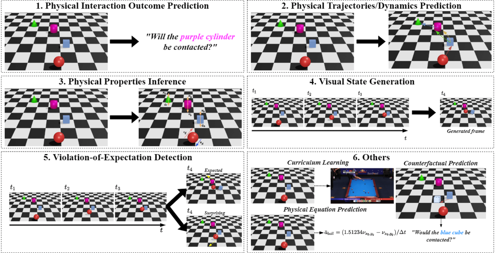
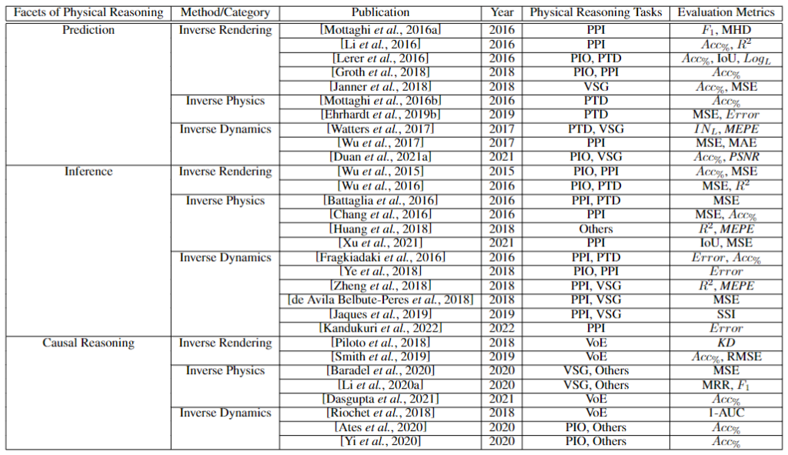

# Awesome Intuitive Physics AI 
This repository contains resources from the accepted survey paper on ["A Survey on Machine Learning Approaches for Modelling Intuitive Physics"](https://arxiv.org/abs/2202.06481) for the IJCAI-ECAI 2022 (Survey Track) with *18% Acceptance Rate*.

With inspiration from, the [awesome](https://github.com/sindresorhus/awesome) lists and and [awesome-cogsci](https://github.com/abi-aryan/awesome-cogsci).

## Abstract
Research in cognitive science has provided extensive evidence of human cognitive ability in performing physical reasoning of objects from noisy perceptual inputs. Such a cognitive ability is commonly known as intuitive physics. With advancements in deep learning, there is an increasing interest in building intelligent systems that are capable of performing physical reasoning from a given scene for the purpose of building better AI systems. As a result, many contemporary approaches in modelling intuitive physics for machine cognition have been inspired by literature from cognitive science. Despite the wide range of work in physical reasoning for machine cognition, there is a scarcity of reviews that organize and group these deep learning approaches. Especially at the intersection of intuitive physics and artificial intelligence, there is a need to make sense of the diverse range of ideas and approaches. Therefore, this paper presents a comprehensive survey of recent advances and techniques in intuitive physics-inspired deep learning approaches for physical reasoning. The survey will first categorize existing deep learning approaches into three facets of physical reasoning before organizing them into three general technical approaches and propose six categorical tasks of the field. Finally, we highlight the challenges of the current field and present some future research directions.

[](https://github.com/jiafei1224/awesome-intuitive-physics-ai/)
[](https://github.com/jiafei1224/awesome-intuitive-physics-ai/)
[](https://github.com/jiafei1224/awesome-intuitive-physics-ai/)

Any question contact [Jiafei Duan](https://duanjiafei.com/). If you see papers missing from the list, please send me an email or a pull request (format see [below](#contributing)).


## Table of Content
- [Contributing](#contributing)
- [Cognitive Science Literatures](#psychology)
- [Facets of Physical Reasoning for AI](#papers)
  - [Prediction](#prediction)  
  - [Inference](#inference)
  - [Causal Reasoning](#causalreasoning)
- [Revalent Surveys](#survey)
- [Physics Engine](#physengine)
- [Cite](#cite)


## <a name="contributing"></a> Contributing
When sending PRs, please put the new paper at the correct chronological position as the following format: <br>

```
* **Paper Title** <br>
*Author(s)* <br>
Conference, Year. [[Paper]](link) [[Code]](link) [[Website]](link)
```
<p align="center">
  
</p>

<p align="center">
   <em>Summary of the six physical reasoning tasks</em>
</p>

<p align="center">
  
</p>

<p align="center">
   <em>Summary of the work for intuitive physics for machine cognition.</em>
</p>


## <a name="papers"></a> Papers on Intutive Physics for AI

### <a name="psychology"></a>Cognitive Science Literatures
* **Intuitive Physics** <br>
*Michael McCloskey* <br>
Scientific American, 1983. [[Paper]](https://www.jstor.org/stable/24968881) 

* **Intuitive physics: the straight-down belief and its origin** <br>
*McCloskey, Michael, Allyson Washburn, and Linda Felch* <br>
Journal of Experimental Psychology: Learning, Memory, and Cognition 9, 1983. [[Paper]](https://psycnet.apa.org/record/1984-11308-001) 

* **Mind games: Game engines as an architecture for intuitive physics** <br>
*Ullman, Tomer D., Elizabeth Spelke, Peter Battaglia, and Joshua B. Tenenbaum* <br>
Trends in cognitive sciences, 2017. [[Paper]](https://www.sciencedirect.com/science/article/abs/pii/S1364661317301134) 

* **Simulation as an engine of physical scene understanding** <br>
*Battaglia, Peter W., Jessica B. Hamrick, and Joshua B. Tenenbaum* <br>
Proceedings of the National Academy of Sciences, 2013. [[Paper]](https://www.pnas.org/content/110/45/18327.short) 

### <a name="prediction"></a> Prediction
* **Newtonian image understanding: Unfolding the dyanmics of object in static images** <br>
*Roozbeh Mottaghi, Hessam Bagherinezhad, Mohammad Rastegari, Ali Farhadi* <br>
CVPR, 2016. [[Paper]](https://openaccess.thecvf.com/content_cvpr_2016/html/Mottaghi_Newtonian_Scene_Understanding_CVPR_2016_paper.html) [[Code]](https://github.com/allenai/newtonian)

* **To fall or not to fall: A visual approach to physical stability prediction** <br>
*Wenbin Li, Seyedmajid Azimi, Aleš Leonardis, Mario Fritz* <br>
AAAI, 2017. [[Paper]](http://proceedings.mlr.press/v48/lerer16.html)

* **Learning physical intuition of block towers by example** <br>
*Adam Lerer, Sam Gross, Rob Fergus* <br>
PMLR, 2016. [[Paper]](http://proceedings.mlr.press/v48/lerer16.html)

* **Shapestacks: Learning vision-based physical intuition for generalised object stacking** <br>
*Oliver Groth, Fabian B Fuchs, Ingmar Posner, and Andrea Vedaldi* <br>
ECCV, 2018. [[Paper]](https://openaccess.thecvf.com/content_ECCV_2018/papers/Oliver_Groth_ShapeStacks_Learning_Vision-Based_ECCV_2018_paper.pdf) [[Code]](https://ogroth.github.io/shapestacks/)

* **Reasoning about physical interactionswith object-oriented prediction and planning** <br>
*Michael Janner, Sergey Levine, William T Freeman, Joshua B Tenenbaum, Chelsea Finn, and Jiajun Wu* <br>
ICLR, 2019. [[Paper]](https://arxiv.org/abs/1812.10972) [[Code]](https://github.com/JannerM/o2p2)

* **"What happens if..." Learning to Predict the Effect of Forces in Images** <br>
*Roozbeh Mottaghi, Mohammad Rastegari, Abhinav Kumar Gupta, and Ali Farhadi* <br>
ECCV, 2016. [[Paper]](https://arxiv.org/abs/1603.05600) [[Code]](https://github.com/allenai/forces)

* **Unsupervised intuitive physics from past experiences** <br>
*Sebastien Ehrhardt, Aron Monszpart, Niloy Jyoti Mitra, and Andrea Vedaldi* <br>
ArXiv, 2019. [[Paper]](https://arxiv.org/abs/1905.10793) 

* **Visual interaction networks: Learning a physics simulator from video** <br>
*Nicholas Watters, Daniel Zoran, Theophane Weber, Peter Battaglia, Razvan Pascanu, and Andrea Tacchetti* <br>
NeurIPS, 2017. [[Paper]](https://arxiv.org/abs/1905.10793) [[Code]](https://github.com/MrGemy95/visual-interaction-networks-pytorch)

* **Learning to see physics via visual de-animation** <br>
*Jiajun Wu, Erika Lu, Pushmeet Kohli, Bill Freeman, and Josh Tenenbaum* <br>
NeurIPS, 2017. [[Paper]](https://papers.nips.cc/paper/2017/file/4c56ff4ce4aaf9573aa5dff913df997a-Paper.pdf) 

* **PIP:Physical Interaction Prediction via Mental Simulation with Span Selection** <br>
*Jiafei Duan, Samson Yu, Soujanya Poria, Bihan Wen, Cheston Tan* <br>
Preprint, 2021. [[Paper]](https://arxiv.org/abs/2109.04683)

### <a name="inference"></a> Inference

* **Galileo: Perceiving Physical Object Properties by Integrating a Physics Engine with Deep Learning** <br>
*Jiajun Wu, Ilker Yildirim, Joseph J. Lim, Bill Freeman, Josh Tenenbaum* <br>
NeurIPS, 2015. [[Paper]](https://papers.nips.cc/paper/2015/hash/d09bf41544a3365a46c9077ebb5e35c3-Abstract.html)

* **Physics 101: Learning physical object properties from unlabeled videos** <br>
*Jiajun Wu, Joseph J. Lim, Hongyi Zhang, Joshua B. Tenenbaum, and William T. Freeman* <br>
BMVC, 2016. [[Paper]](http://www.bmva.org/bmvc/2016/papers/paper039/index.html) [[Code]](http://phys101.csail.mit.edu/)

* **Interaction network for learning about objects, relations and physics** <br>
*Peter W. Battaglia, Razvan Pascanu, Matthew Lai, Danilo Rezende, Koray Kavukcuoglu* <br>
NeurIPS, 2016. [[Paper]](https://proceedings.neurips.cc/paper/2016/file/3147da8ab4a0437c15ef51a5cc7f2dc4-Paper.pdf) [[Code]](https://github.com/jsikyoon/Interaction-networks_tensorflow)

* **A compositional object-based approach to learning physical dynamics** <br>
*Michael B Chang, Tomer Ullman, Antonio Torralba, and Joshua B Tenenbaum* <br>
ICLR, 2017. [[Paper]](https://arxiv.org/abs/1612.00341) [[Code]](https://github.com/mbchang/dynamics)

* **Perceiving physical equation by observing visual scenarios** <br>
*Siyu Huang, Zhi-Qi Cheng, Xi Li, Xiao Wu, Zhongfei Zhang, and Alexander Hauptmann* <br>
NeurIPS Workshop, 2018. [[Paper]](https://arxiv.org/abs/1811.12238) 

* **A bayesian-symbolic approach to reasoning and learning in intuitive physics** <br>
*Kai Xu, Akash Srivastava, Dan Gutfreund, Felix Sosa, Tomer Ullman, Josh Tenenbaum, and Charles Sutton* <br>
NeurIPS, 2021. [[Paper]](https://openreview.net/forum?id=-YCAwPdyPKw) [[Code]](https://github.com/xukai92/bsp)

* **Learning visual predictive models of physics for playing billiards** <br>
*Katerina Fragkiadaki, Pulkit Agrawal, Sergey Levine, and Jitendra Malik* <br>
NeurIPS, 2021. [[Paper]](https://arxiv.org/abs/1511.07404)

* **Interpretable Intuitive Physics Model** <br>
*Ye, Tian, Xiaolong Wang, James Davidson, and Abhinav Gupta* <br>
ArXiv, 2015. [[Paper]](https://openaccess.thecvf.com/content_ECCV_2018/papers/Tian_Ye_Interpretable_Intuitive_Physics_ECCV_2018_paper.pdf)

* **Unsupervised learning of latent physical properties using perception-prediction networks** <br>
*David Zheng, Vinson Luo, Jiajun Wu, Joshua B. Tenenbaum* <br>
IJCAI, 2018. [[Paper]](https://arxiv.org/abs/1807.09244)

* **End-to-End Differentiable Physics for Learning and Control** <br>
*Filipe de Avila Belbute-Peres, Kevin Smith, Kelsey Allen, Josh Tenenbaum, J. Zico Kolter* <br>
NeurIPS, 2018. [[Paper]](https://papers.nips.cc/paper/2018/file/842424a1d0595b76ec4fa03c46e8d755-Paper.pdf) 

* **Physics-as-inverse-graphics: Unsupervised physical parameter estimation from video** <br>
*Miguel Jaques, Michael Burke, and Timothy Hospedales* <br>
ICLR, 2020. [[Paper]](https://papers.nips.cc/paper/2018/file/842424a1d0595b76ec4fa03c46e8d755-Paper.pdf) [[Code]](https://github.com/seuqaj114/paig)

* **Physics-as-inverse-graphics: Unsupervised physical parameter estimation from video** <br>
*Miguel Jaques, Michael Burke, and Timothy Hospedales* <br>
ICLR, 2020. [[Paper]](https://papers.nips.cc/paper/2018/file/842424a1d0595b76ec4fa03c46e8d755-Paper.pdf) [[Code]](https://github.com/seuqaj114/paig)

* **Physical representation learning and parameter identification from video using differentiable physics** <br>
*Rama Krishna Kandukuri, Jan Achterhold, Michael Moeller, and Joerg Stueckler* <br>
IJCV, 2022. [[Paper]](https://link.springer.com/article/10.1007/s11263-021-01493-5) [[Code]](https://github.com/pulkitag/pyphy-engine)

### <a name="causalreasoning"></a> Causal Reasoning

* **Probing physics knowledge using tools from developmental psychology** <br>
*Luis Piloto, Ari Weinstein, Dhruva TB, Arun Ahuja, Mehdi Mirza, Greg Wayne, David Amos, Chia-chun Hung, and Matt Botvinick* <br>
ArXiv, 2018. [[Paper]](https://arxiv.org/abs/1804.01128) 

* **Modeling expectation violation in intuitive physics with coarse probabilistic object representations** <br>
*Kevin Smith, Lingjie Mei, Shunyu Yao, Jiajun Wu, Elizabeth Spelke, Joshua Tenenbaum, and Tomer Ullman* <br>
NeruIPS, 2019. [[Paper]](https://proceedings.neurips.cc/paper/2019/hash/e88f243bf341ded9b4ced444795c3f17-Abstract.html) [[Code]](https://github.com/JerryLingjieMei/ADEPT-Model-Release)

* **CoPhy: Counterfactual Learning of Physical Dynamics** <br>
*Fabien Baradel, Natalia Neverova, Julien Mille, Greg Mori, Christian Wolf* <br>
ICLR, 2020. [[Paper]](https://arxiv.org/abs/1909.12000) [[Code]](https://github.com/fabienbaradel/cophy)

* **Causal world models by unsupervised deconfounding of physical dynamics** <br>
*Minne Li, Mengyue Yang, Furui Liu, Xu Chen, Zhitang Chen, and Jun Wang* <br>
ArXiv, 2020. [[Paper]](https://arxiv.org/abs/2012.14228)

* **A Benchmark for Modeling Violation-of-Expectation in Physical Reasoning Across Event Categories** <br>
*Arijit Dasgupta, Jiafei Duan, Marcelo H Ang Jr, Yi Lin, Su-hua Wang, Renée Baillargeon, Cheston Tan* <br>
ArXiv, 2021. [[Paper]](https://arxiv.org/abs/2111.08826) 

* **Intphys: A framework and benchmark for visual intuitive physics reasoning** <br>
*Ronan Riochet, Mario Ynocente Castro, Mathieu Bernard, Adam Lerer, Rob Fergus, Veronique Izard, and Emmanuel Dupoux* <br>
IEEE PAMI. [[Paper]](https://ieeexplore.ieee.org/stamp/stamp.jsp?arnumber=9442261) [[Code]](https://intphys.com/)

* **Craft:A benchmark for causal reasoning about forces and interactions** <br>
*Tayfun Ates, Muhammed Samil Atesoglu, Cagatay Yigit, Ilker Kesen, Mert Kobas, Erkut Erdem, Aykut Erdem, Tilbe Goksun, and Deniz Yuret* <br>
ACL, 2022. [[Paper]](https://arxiv.org/abs/2012.04293) [[Code]](https://github.com/hucvl/craft)

* **CLEVRER: collision events for video representation and reasoning** <br>
*Kexin Yi, Chuang Gan, Yunzhu Li, Pushmeet Kohli, Jiajun Wu, Antonio Torralba, and Joshua B.Tenenbaum* <br>
ICLR, 2020. [[Paper]](https://arxiv.org/abs/1910.01442) [[Code]](https://github.com/chuangg/CLEVRER)

### <a name="survey"></a> Revalent Surveys
* **Intuitive physics: Current research and controversies** <br>
*Kubricht, James R., Keith J. Holyoak, and Hongjing Lu* <br>
Trends in cognitive sciences, 2017. [[Paper]](https://www.sciencedirect.com/science/article/abs/pii/S1364661317301262) 

* **Dark, Beyond Deep: A Paradigm Shift to Cognitive AI with Humanlike Common Sense** <br>
*Yixin Zhua,Tao Gao, Lifeng Fan, Siyuan Huang, Mark Edmonds, Hangxin Liu, Feng Gao, Chi Zhang, Siyuan Qia,Ying Nian Wua, Joshua B. Tenenbaum, Song-Chun Zhu*<br>
Engineering, 2020. [[Paper]](https://arxiv.org/pdf/2004.09044.pdf) 

<!-- 
[Revalent Surveys](#survey)
## <a name="datasets"></a> Datasets
* **Physion: Evaluating Physical Prediction from Vision in Humans and Machines.** <br>
*Daniel M. Bear, Elias Wang, Damian Mrowca, Felix J. Binder, Hsiau-Yu Fish Tung, R. T. Pramod, Cameron Holdaway, Sirui Tao, Kevin Smith, Fan-Yun Sun, Li Fei-Fei, Nancy Kanwisher, Joshua B. Tenenbaum, Daniel L. K. Yamins, Judith E. Fan * <br>
NeurIPS, 2021. [[Paper]](https://arxiv.org/pdf/2106.08261v2.pdf) [[Code]](https://github.com/cogtoolslab/physics-benchmarking-neurips2021)


 -->

## <a name="physengine"></a> Physics Engine
* Bullet (Blender)
* Newton Game Dynamics
* PhysX (Unreal & Omniverse)
* Box2D
* Tokamak Game Physics
* Havok Physics
* Phyz
* Unity Physics Engine (Unity)

## <a name="cite"></a> Cite
@article{duan2022survey,
  title={A Survey on Machine Learning Approaches for Modelling Intuitive Physics},
  author={Duan, Jiafei and Dasgupta, Arijit and Fischer, Jason and Tan, Cheston},
  journal={arXiv preprint arXiv:2202.06481},
  year={2022}
}
